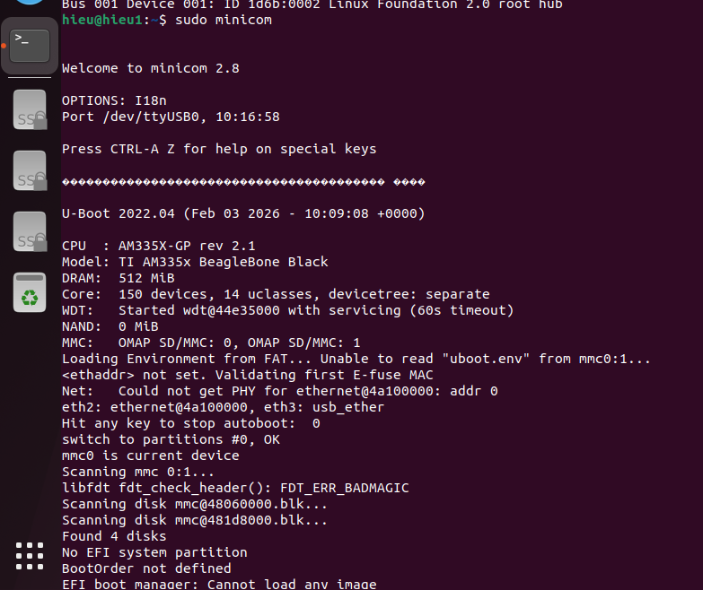
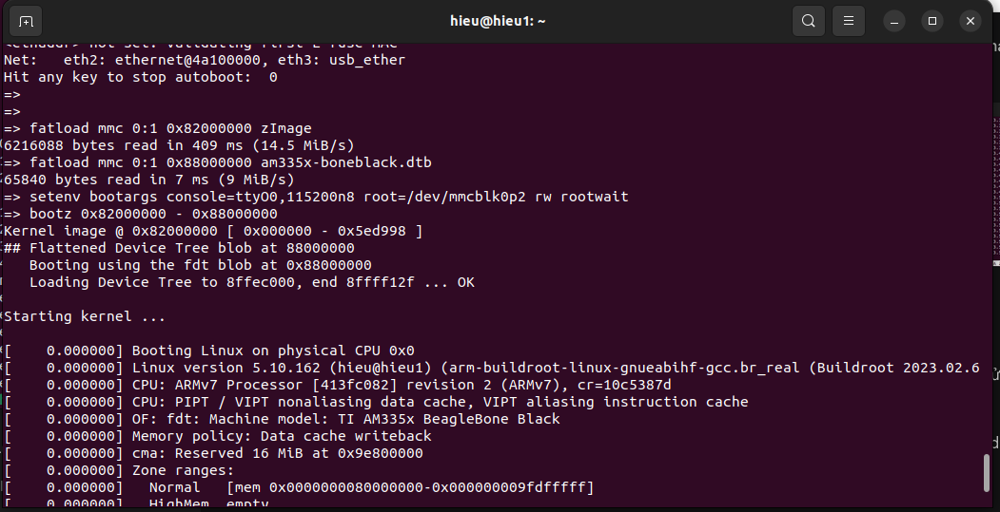

# NHÓM 2 BÁO CÁO BÀI TẬP TUẦN 2

## CÔNG VIỆC ĐÃ LÀM: 

- Biên dịch và cài đặt uboot
- Biên dịch và cài đặt Kernel

## Chi tiết:

- Biên dịch ra các file cho uboot, MLO, zimage và boneblack.dtb

  
  
- Load được vào uboot, hiển thị tt phần cứng, uboot version và phản hồi với các lệnh

  
 
  
  
- Nạp file image, load vào Kernel

  
 
- Đợi root

  